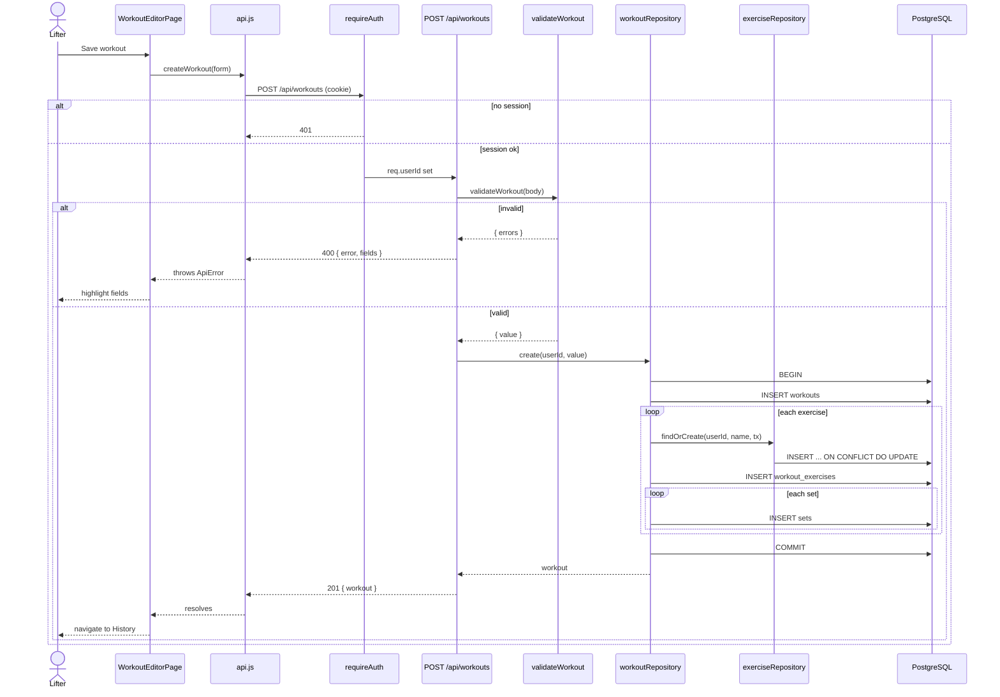
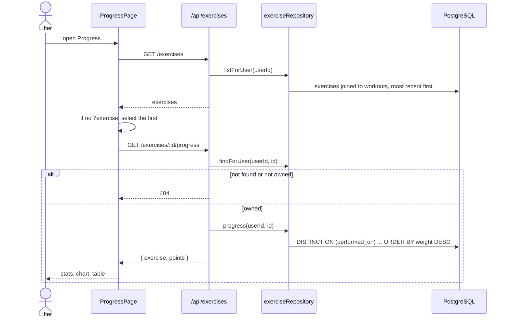

# Component designs

Detailed designs for the two use cases that exercise the most of the system.

## 1. Log a workout (UC3)

### Components involved

| Layer | Component | Responsibility |
|---|---|---|
| Client | `WorkoutEditorPage` | Form state, add/remove sets and exercises, show field errors |
| Client | `api.createWorkout` | POST the form, convert error responses into `ApiError` with `fields` |
| Server | `requireAuth` | Reject with 401 unless the session has a user |
| Server | `routes/workouts` POST | Validate, call repository, respond 201 |
| Server | `validateWorkout` | Normalize and check every field; collect all errors at once |
| Server | `workoutRepository.create` | Transactional insert of workout, exercises, and sets |
| Server | `exerciseRepository.findOrCreate` | Reuse an exercise by case-insensitive name or create it |

### Sequence

### Key logic

**Validation collects every error, not just the first.** A lifter who typed
three bad values sees all three highlighted at once. Errors are keyed by path
(`exercises[1].sets[0].reps`), and the editor looks up each input's key to set
`aria-invalid`.

**Form inputs arrive as strings.** `validateWorkout` accepts `"27.5"` and
converts it, so the client doesn't need its own parsing. Blank strings are
treated as missing, not zero.

**Find-or-create is atomic.** `INSERT ... ON CONFLICT (user_id, lower(name)) DO
UPDATE SET name = exercises.name RETURNING id` returns the existing row's ID
when the name exists and a new one otherwise, in one statement with no race.

**All or nothing.** If any insert fails, the transaction rolls back and no
half-saved workout appears in history.

**Edit reuses the same path.** `PUT` runs the same validation, then in one
transaction updates the workout row (`WHERE id = $1 AND user_id = $2`), deletes
its `workout_exercises` (sets cascade), and re-inserts. If the `UPDATE`
matches zero rows, the workout isn't the caller's and the route returns 404.

### Error handling

| Situation | Response | Client shows |
|---|---|---|
| Session expired | 401 | Redirect to login on next navigation |
| Validation failure | 400 with `fields` | Banner plus highlighted inputs |
| Malformed JSON | 400 | Banner |
| Database error | 500, details logged server-side only | "Something went wrong on the server." |

## 2. View progress (UC6)

### Components involved

| Layer | Component | Responsibility |
|---|---|---|
| Client | `ProgressPage` | Exercise picker (kept in the URL as `?exercise=ID`), summary stats, chart, table |
| Server | `routes/exercises` | `GET /exercises` and `GET /exercises/:id/progress` |
| Server | `exerciseRepository.progress` | One point per date: the heaviest set |

### Sequence

### Key logic

**What counts as "progress".** For each date, the heaviest set wins, with
reps breaking ties. Postgres's `DISTINCT ON (w.performed_on)` with
`ORDER BY w.performed_on, s.weight DESC, s.reps DESC` returns exactly that row
per date in one query.

**Summary numbers are computed on the client** from the points already
fetched: heaviest (max), latest (last point), and change (last minus first).
No extra endpoint needed.

**Single data point.** Recharts draws one dot, the change shows `+0`, and a
hint explains that logging again will show a trend (story #8 acceptance
criterion).

**The chart is also a table.** The chart has an `aria-label` summary, and the
same points are listed underneath in a table, so screen reader users and
anyone who wants exact numbers get the same information.

**Selection lives in the URL.** `?exercise=12` means refresh and the back
button keep the selected exercise, and a progress view can be bookmarked.
