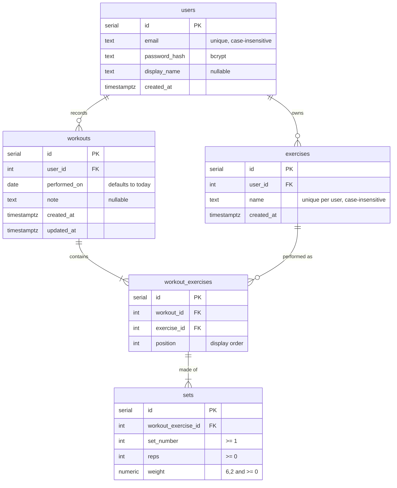

# Data model

PostgreSQL 16. The schema is created by
[`server/src/db/migrations/001_initial_schema.sql`](../../server/src/db/migrations/001_initial_schema.sql)
and applied with `npm run migrate --prefix server`.

## Entity-relationship diagram

A sixth table, `user_sessions`, holds login sessions for `connect-pg-simple`.
It has no foreign keys and isn't part of the domain.

## Design decisions

**Exercises belong to a user.** One lifter's "Bench" and another's "Bench
Press" never collide, and one user can never see another's exercise list. The
unique index on `(user_id, lower(name))` means "bench press" and "Bench Press"
resolve to the same row, so progress isn't split across spellings.

**`workout_exercises` is a real table, not just a join.** It carries
`position` so exercises display in the order they were done, and sets hang off
it rather than off `workouts`. The same exercise could appear twice in one
workout (a superset or a back-off block) without ambiguity.

**Weights are `NUMERIC(6,2)`, not floating point.** Plates come in 1.25 and
2.5 increments, and floats would turn 102.5 into 102.4999... in sums and
comparisons. The API converts to a JS number on the way out.

**Dates are `DATE`, not timestamps.** A workout happens on a day. Storing a
timestamp would shift sessions to the wrong day for anyone west of UTC.

## Integrity rules

| Rule | Enforced by |
|---|---|
| Email unique regardless of case | `users_email_lower_idx` unique index |
| Reps and weight never negative | `CHECK` constraints on `sets`, plus API validation |
| Set numbers start at 1 | `CHECK (set_number >= 1)` |
| Deleting a user deletes all their data | `ON DELETE CASCADE` from `users` down |
| Deleting a workout deletes its exercises and sets | `ON DELETE CASCADE` on `workout_exercises` and `sets` |
| A workout is saved all or nothing | Repository wraps create and update in a transaction |

## Indexes

| Index | Serves |
|---|---|
| `workouts (user_id, performed_on DESC)` | History list, newest first |
| `workout_exercises (workout_id)` | Loading one workout |
| `workout_exercises (exercise_id)` | Progress query for one exercise |
| `sets (workout_exercise_id)` | Loading sets for each performed exercise |
| `user_sessions (expire)` | Pruning expired sessions |

## Seed data

`npm run seed --prefix server` (`server/src/db/seed.js`) creates:

| Account | Data |
|---|---|
| `demo@replog.test` / `demo1234` | 8 weeks of a push/pull/legs split, 3 sessions a week with weights climbing weekly, one skipped session so the history looks real |
| `empty@replog.test` / `demo1234` | No data, for testing empty states |

The script deletes and recreates both accounts, so it's safe to run repeatedly.
