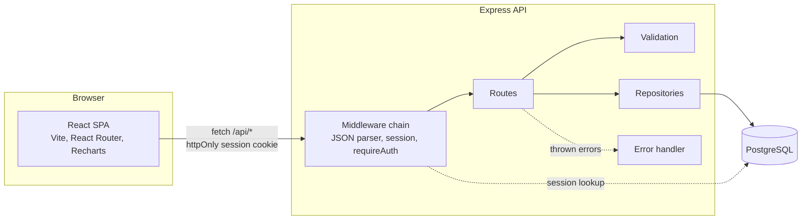
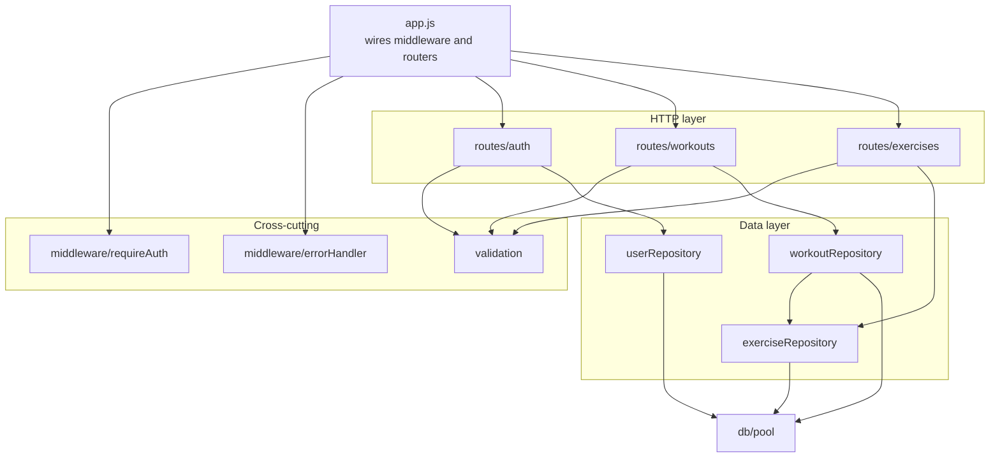
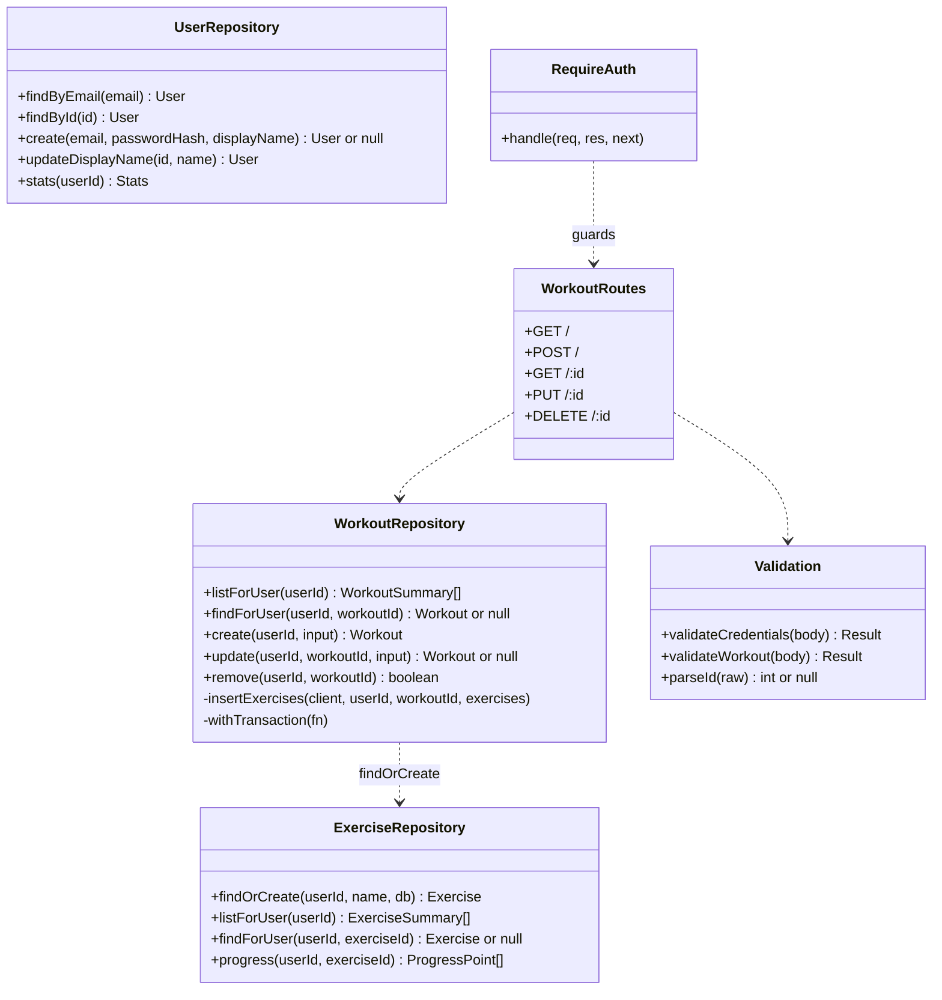

# Design

## Architecture

A three-tier web application: a React single-page app talks JSON over HTTP to
an Express API, which is the only thing that talks to PostgreSQL.



In development, Vite proxies `/api` to the Express server on port 3001, so the
browser sees one origin and the session cookie needs no CORS setup.

## Module boundaries

Each server module has one job and may only call the layer below it.



| Module | Owns | Must not |
|---|---|---|
| `routes/*` | HTTP concerns: status codes, parsing params, shaping JSON | Contain SQL |
| `validation.js` | Pure input rules, returning `{ value }` or `{ errors }` | Touch the database or `req`/`res` |
| `repositories/*` | All SQL, transactions, and per-user scoping | Know about HTTP |
| `middleware/requireAuth` | Deciding whether a request has a user | Load data |
| `middleware/errorHandler` | Turning thrown errors into safe JSON | Leak stack traces or SQL |

Client modules follow the same idea: `api.js` is the only file that calls
`fetch`, `auth.jsx` owns the session state, and each page in `pages/` owns one
screen.

## Design classes

The server is plain CommonJS modules rather than ES classes. Each module is a
singleton with the interface below.



Note that every repository method that reads or writes user data takes
`userId` as its first argument. There is no method that loads a workout by ID
alone, so it's impossible to forget the ownership check.

## API contract

Base path `/api`. Request and response bodies are JSON. Authentication is an
httpOnly `replog.sid` session cookie set by register or login.

### Conventions

- **Errors** always look like `{ "error": "Human-readable message" }`. Validation
  errors add `fields`, a map from field path to message, for example
  `{ "exercises[0].sets[1].reps": "Reps must be a whole number from 0 to 1000." }`.
- **Status codes:** `200` OK, `201` created, `204` no content, `400` invalid input,
  `401` not logged in or wrong credentials, `404` not found *or not yours*,
  `409` email taken, `500` server error.
- **Dates** are `YYYY-MM-DD` strings. **Weights** are numbers in pounds.

### Endpoints

| Method | Path | Auth | Body | Success |
|---|---|---|---|---|
| GET | `/health` | No | | `200 { ok: true }` |
| POST | `/auth/register` | No | `{ email, password, displayName? }` | `201 { user }` and session cookie |
| POST | `/auth/login` | No | `{ email, password }` | `200 { user }` and session cookie |
| POST | `/auth/logout` | No | | `204` |
| GET | `/auth/me` | Yes | | `200 { user, stats }` |
| PATCH | `/auth/me` | Yes | `{ displayName }` | `200 { user }` |
| GET | `/workouts` | Yes | | `200 { workouts: WorkoutSummary[] }`, newest first |
| POST | `/workouts` | Yes | `WorkoutInput` | `201 { workout }` with `Location` header |
| GET | `/workouts/:id` | Yes | | `200 { workout }` |
| PUT | `/workouts/:id` | Yes | `WorkoutInput` | `200 { workout }` (replaces exercises and sets) |
| DELETE | `/workouts/:id` | Yes | | `204` |
| GET | `/exercises` | Yes | | `200 { exercises: ExerciseSummary[] }` |
| GET | `/exercises/:id/progress` | Yes | | `200 { exercise, points: ProgressPoint[] }`, oldest first |

### Shapes

```jsonc
// User
{ "id": 3, "email": "demo@replog.test", "displayName": "Marcus", "createdAt": "2026-09-28T15:14:18.865Z" }

// WorkoutInput (POST and PUT body)
{
  "performedOn": "2026-09-28",        // optional, defaults to today
  "note": "Push day",                  // optional
  "exercises": [                        // 1 to 30
    { "name": "Bench Press", "sets": [  // 1 to 50 sets
      { "reps": 5, "weight": 185 },     // reps: integer 0-1000, weight: 0-9999.99
      { "reps": 5, "weight": 185 }
    ]}
  ]
}

// Workout (GET /workouts/:id)
{
  "id": 47, "performedOn": "2026-09-28", "note": "Push day",
  "createdAt": "...", "updatedAt": "...",
  "exercises": [
    { "exerciseId": 1, "name": "Bench Press",
      "sets": [{ "setNumber": 1, "reps": 5, "weight": 185 }] }
  ]
}

// WorkoutSummary (GET /workouts)
{ "id": 47, "performedOn": "2026-09-28", "note": "Push day",
  "exercises": [{ "name": "Bench Press", "setCount": 2 }] }

// ExerciseSummary
{ "id": 1, "name": "Bench Press", "timesPerformed": 8, "lastPerformedOn": "2026-09-22" }

// ProgressPoint: the heaviest set on each date
{ "date": "2026-09-22", "topWeight": 200, "reps": 5, "workoutId": 44 }
```

## ADR-001: PostgreSQL with server-side sessions

**Status:** Accepted, Milestone 1

**Context.** We need to store relational data (users, workouts, exercises,
sets) with real constraints, and we need authentication that isolates each
user's data. Our proposal left "session or JWT" open.

**Decision.** Use PostgreSQL for all data, and authenticate with
`express-session` backed by a `user_sessions` table in the same database
(`connect-pg-simple`). The session cookie is `httpOnly`, `SameSite=Lax`, and
`Secure` in production. Passwords are hashed with bcrypt (cost 12).

**Why sessions over JWT.**

| Concern | Server sessions | JWT in the browser |
|---|---|---|
| Logout | Delete the row. The cookie is dead immediately. | Token stays valid until it expires unless we build a denylist, which is a session store anyway. |
| XSS exposure | `httpOnly` cookie can't be read by scripts. | If stored in `localStorage`, any injected script can steal it. |
| Moving parts | One table we already have a database for. | Signing keys, expiry, refresh tokens. |
| Scaling | Every request does a session lookup. Fine at our scale, and the table is indexed. | Stateless, which matters at a scale we won't reach. |

**Consequences.** One extra query per authenticated request. The API and
client must share an origin (the Vite proxy in development, one host in
production), which also removes the need for CORS. Session fixation is handled
by regenerating the session ID at login. If we ever need a mobile client, we'd
revisit this.
