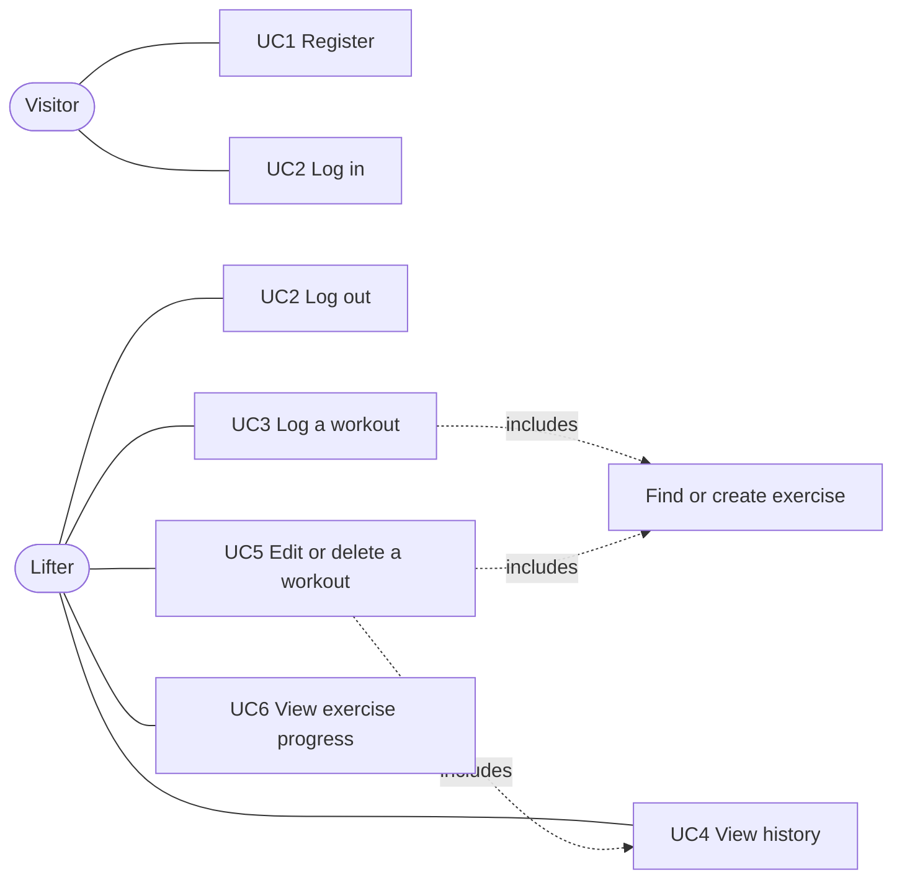
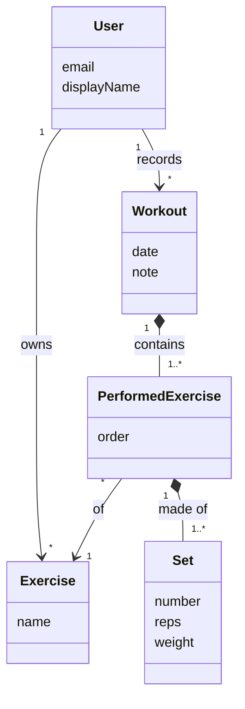
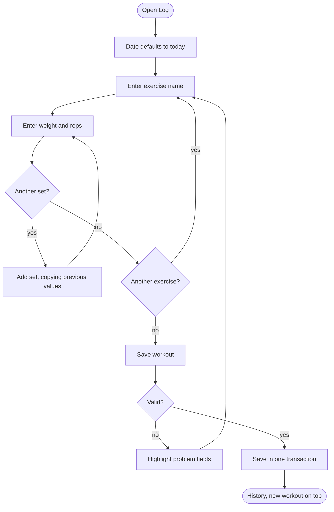

# Requirements

## Actors

| Actor | Description |
|---|---|
| Visitor | Anyone without a session. Can register or log in. |
| Lifter | A logged-in user. Our personas are Marcus (consistent lifter, logs one-handed between sets) and Priya (beginner, needs plain labels and a clear record of last week). |

## Use case overview

Every Lifter use case includes the precondition "the request is authenticated
and scoped to the lifter's own data" (story #6). That rule is enforced once in
middleware and once in the repository layer, not per screen. See
[design.md](design.md#module-boundaries).

## Use cases

### UC1 Register (story #1)

- **Actor:** Visitor
- **Precondition:** No active session.
- **Main flow:**
  1. Visitor opens Create account and enters email, password, and an optional name.
  2. System validates the email format and that the password is 8 to 128 characters.
  3. System hashes the password with bcrypt and stores the account.
  4. System starts a session and shows the (empty) history.
- **Alternate flows:**
  - 2a. Input invalid: the form shows the error next to the field. Nothing is saved.
  - 3a. Email already registered (case-insensitive): "An account with that email already exists."
- **Postcondition:** Account exists; the plaintext password is never stored or logged.

### UC2 Log in / log out (story #2)

- **Actor:** Visitor (log in), Lifter (log out)
- **Main flow (log in):**
  1. Visitor enters email and password.
  2. System compares the password against the stored hash.
  3. System regenerates the session ID, stores the user ID in the session, and redirects to the page the visitor originally asked for (or history).
- **Alternate flows:**
  - 2a. Wrong password or unknown email: the same generic message, "Email or password is incorrect." The response doesn't reveal which was wrong.
  - Any protected page opened while signed out redirects to Log in.
- **Main flow (log out):** Lifter chooses Log out on Profile. System destroys the session and clears the cookie.

### UC3 Log a workout (stories #3, #4)

- **Actor:** Lifter
- **Precondition:** Logged in.
- **Main flow:**
  1. Lifter chooses Log. The date defaults to today.
  2. Lifter types an exercise name. Previously used names are suggested.
  3. Lifter enters weight and reps for set 1. Add set copies the previous set's values.
  4. Lifter repeats steps 2 and 3 for more exercises and optionally adds a note.
  5. Lifter chooses Save workout.
  6. System validates, saves everything in one transaction, and returns to history with the new workout at the top.
- **Alternate flows:**
  - 6a. No exercises, an exercise without sets, a blank name, negative or non-numeric weight or reps, or an impossible date: nothing is saved and each problem is highlighted.
  - 6b. Exercise name matches an existing one in a different case ("bench press"): the existing exercise is reused so progress stays in one series.
- **Postcondition:** Workout, its exercises, and its sets persist and survive reload.

### UC4 View history (story #5)

- **Main flow:** Lifter opens History and sees their workouts newest first, each with date, note (or weekday), and "Exercise ×sets" summary.
- **Alternate flow:** No workouts: an empty state explains what will appear and links to Log.

### UC5 Edit or delete a workout (story #7)

- **Main flow (edit):** Lifter opens a workout from History, changes anything, and saves. The saved version replaces the old one.
- **Main flow (delete):** Lifter chooses Delete workout, confirms, and returns to History without it.
- **Alternate flow:** The workout ID doesn't exist or belongs to someone else: "Workout not found." The two cases look identical.

### UC6 View exercise progress (story #8)

- **Main flow:**
  1. Lifter opens Progress and picks an exercise (defaults to the most recently trained).
  2. System shows heaviest, latest, and change-since-first, a line chart of the top set per session, and the same data as a table.
- **Alternate flows:**
  - One session only: the chart shows a single point and a hint to log again.
  - No exercises yet: empty state pointing to Log.

## Analysis model

### Domain model

Conceptual classes and their relationships. The physical tables are in
[data-model.md](data-model.md).

`PerformedExercise` is the key analysis decision. A workout doesn't contain
exercises directly; it contains *performances* of exercises. That lets the same
Exercise appear across many workouts, which is exactly what the progress view
needs to chart.

### Activity: log a workout

