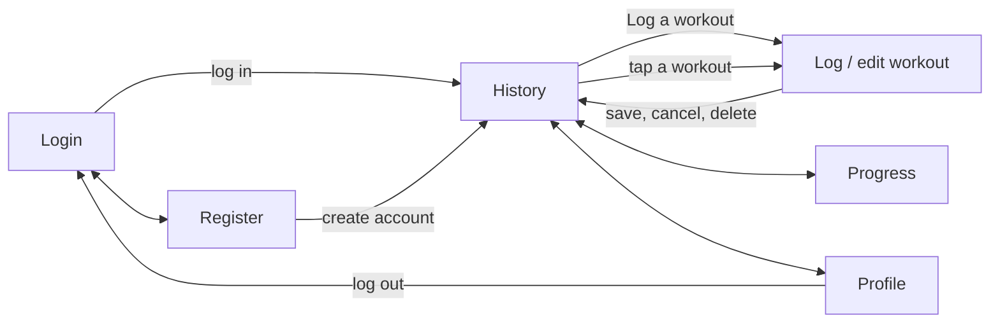
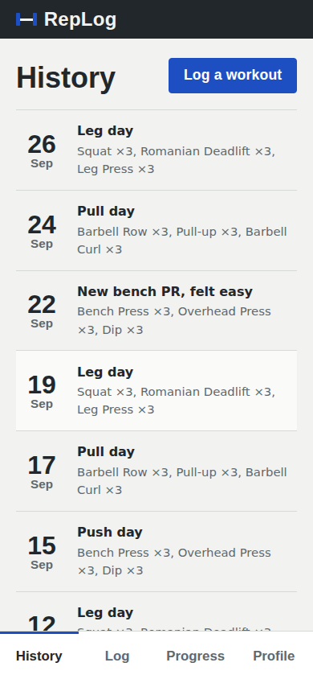
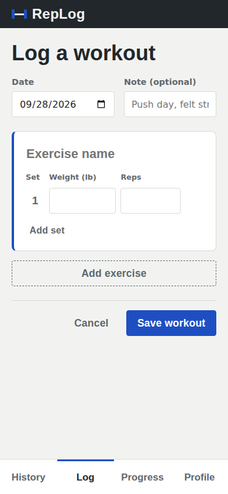
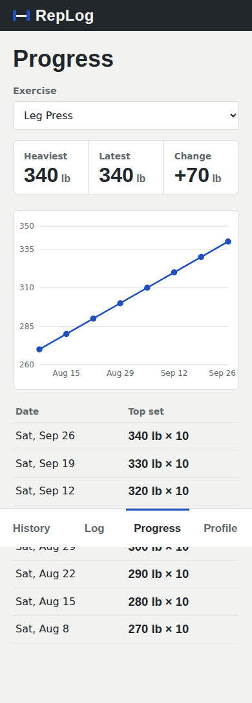
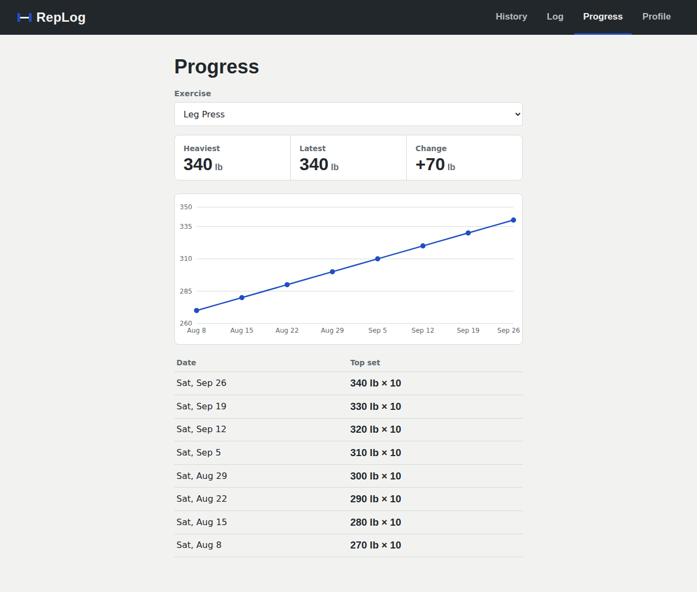

# UX design

## Design goals from the personas

| Persona | Need | What we did |
|---|---|---|
| Marcus, logs one-handed between sets | Fast entry, reachable controls | Bottom tab bar on phones; large numeric inputs that open the number pad; Add set copies the previous set so a straight set is one tap |
| Marcus | See whether a lift is going up | Progress opens on the most recently trained exercise with heaviest, latest, and change up front |
| Priya, new to lifting | Plain labels | "Weight (lb)", "Reps", "Log a workout", "History". No jargon like "volume" or "1RM" in the MVP |
| Priya | Remember last week | History shows each session's exercises and set counts at a glance |

## Screen map



## Wireframes

Phone layout (primary). Desktop uses the same content in a centered column
with the nav moved to the top bar.

```
 Login                     History                    Log a workout
┌──────────────────────┐  ┌──────────────────────┐   ┌──────────────────────┐
│ ▐━▌                  │  │ ▐━▌ RepLog           │   │ ▐━▌ RepLog           │
│ RepLog               │  ├──────────────────────┤   ├──────────────────────┤
│ Every set you lift,  │  │ History  [Log a wkt] │   │ Log a workout        │
│ in one place.        │  │──────────────────────│   │ Date        Note     │
│ ┌──────────────────┐ │  │ 26  Leg day          │   │ [09/28/26] [Push da] │
│ │ Log in           │ │  │ Sep Squat ×3, RDL ×3 │   │┃Bench Press         │
│ │ Email            │ │  │──────────────────────│   │┃Set Weight(lb) Reps │
│ │ [              ] │ │  │ 24  Pull day         │   │┃ 1  [ 185 ]  [ 5 ]  │
│ │ Password         │ │  │ Sep Row ×3, Pull ×3  │   │┃ 2  [ 185 ]  [ 5 ] ×│
│ │ [              ] │ │  │──────────────────────│   │┃ Add set            │
│ │ [    Log in    ] │ │  │ 22  New bench PR     │   │[ - - Add exercise - ]│
│ │ New here? Create │ │  │ Sep Bench ×3, OHP ×3 │   │      Cancel [ Save ] │
│ └──────────────────┘ │  ├──────────────────────┤   ├──────────────────────┤
│                      │  │History Log Prog Prof │   │History Log Prog Prof │
└──────────────────────┘  └──────────────────────┘   └──────────────────────┘

 Progress                  Profile
┌──────────────────────┐  ┌──────────────────────┐
│ Progress             │  │ Profile              │
│ Exercise [Bench   ▾] │  │ Workouts Exer. Last  │
│ Heaviest Latest  Chg │  │   23      9   Sep 26 │
│  200     200    +35  │  │ Signed in as demo@.. │
│ ┌──────────────────┐ │  │ Display name         │
│ │          •──•    │ │  │ [Marcus            ] │
│ │    •──•──        │ │  │ [Save name]          │
│ │ •──              │ │  │                      │
│ └──────────────────┘ │  │      Log out         │
│ Date        Top set  │  │                      │
│ Mon Sep 22  200 × 5  │  ├──────────────────────┤
├──────────────────────┤  │History Log Prog Prof │
│History Log Prog Prof │  └──────────────────────┘
└──────────────────────┘
```

Screenshots of the built screens are in [`screenshots/`](screenshots/).

| Phone: History | Phone: Log a workout | Phone: Progress |
|---|---|---|
|  |  |  |



## Responsive behavior

The layout is phone-first: the base CSS is the phone layout, and
`min-width` media queries add to it.

| Width | Behavior |
|---|---|
| Under 720px | Four-tab nav fixed to the bottom of the screen, above the iOS home indicator (`env(safe-area-inset-bottom)`). Page content gets bottom padding so the last row is never hidden behind the bar. |
| 720px and up | Nav moves into the dark top bar. Content stays in a centered column capped at about 44rem so rows and the chart stay readable. |
| 860px and up (login and register) | Brand and form sit side by side. |

Other choices:

- **Touch targets** are at least 44px tall (buttons, inputs, nav tabs).
- **Number inputs** use `inputMode="decimal"` for weight and `inputMode="numeric"` for reps, so phones open the number pad instead of the full keyboard.
- **The chart** uses Recharts' `ResponsiveContainer`, so it fills whatever width it gets.
- **Set tables** use fixed narrow columns for the set number and remove button, so the weight and reps inputs get the rest of the width at 320px.

## Visual language

The palette comes from a gym floor: chalk background, iron text, rubber-mat
gray borders, and the blue of a 20 kg plate as the one accent color. Barlow
Condensed, which echoes the stencil numerals on plates, is used for headings
and anywhere a number matters (weights, reps, dates), so the numbers read at
arm's length. Barlow is the body face.

## Design patterns

### Repository (server data access)

**Where:** `server/src/repositories/`.

**What:** Every SQL query lives in a repository module. Routes call methods
like `workoutRepository.findForUser(userId, id)` and never see SQL.

**Why here:** Our most important requirement, story #6, is that a user can
never reach another user's data. Putting every query behind a repository whose
methods all take `userId` first makes the ownership filter part of the
interface. A route can't forget the check, because no method exists that skips
it. It also gives Milestone 2's unit tests a single seam to test data access.

### Chain of Responsibility (Express middleware)

**Where:** `server/src/app.js` and `server/src/middleware/`.

**What:** Each request passes through a chain: JSON parser, session loader,
`requireAuth`, the router, and finally `errorHandler`. Each link either
handles the request (for example, `requireAuth` ends it with 401) or passes it
on with `next()`.

**Why here:** Authentication applies to whole groups of routes. Mounting
`requireAuth` once in front of `/api/workouts` and `/api/exercises` means
every current and future route in those routers is protected by default.
The error handler at the end of the chain guarantees that no route can leak a
stack trace, even one we add later and forget to wrap.

### Provider / Context (client auth state)

**Where:** `client/src/auth.jsx`.

**What:** `AuthProvider` loads the current user once and exposes `user`,
`login`, `register`, and `logout` through React context. `RequireAuth` in
`App.jsx` reads it to guard routes.

**Why here:** Four screens and the router all need to know who's logged in.
Context avoids passing the user through every component and keeps one source
of truth.

## Accessibility

- Every input has a visible label (or a screen-reader label for the set grid). Invalid inputs get `aria-invalid`, and errors are linked with `aria-describedby`.
- Error banners use `role="alert"`, and the "Name saved" confirmation uses `role="status"`.
- Visible keyboard focus: a 3px plate-blue outline on every focusable element.
- The progress chart has a text summary and a data table with the same values.
- Motion is off when the user prefers reduced motion. The chart doesn't animate.
- Text and interactive colors meet WCAG AA contrast against their backgrounds.
